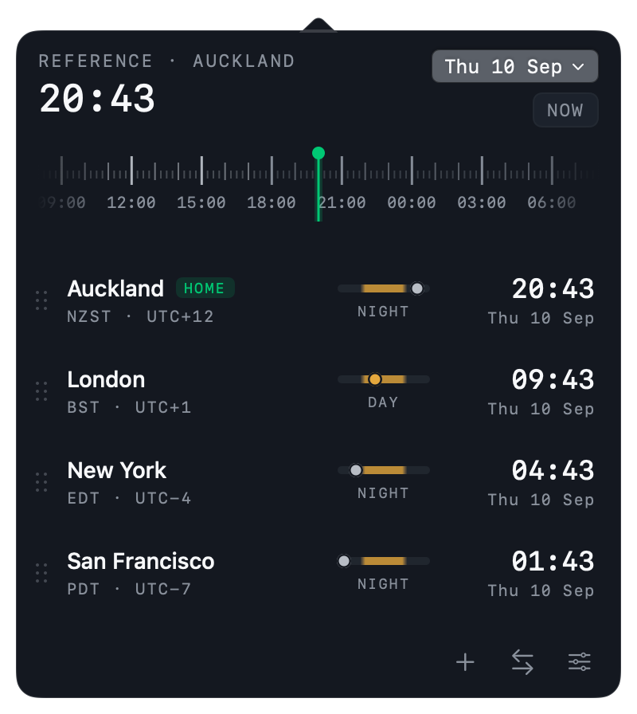
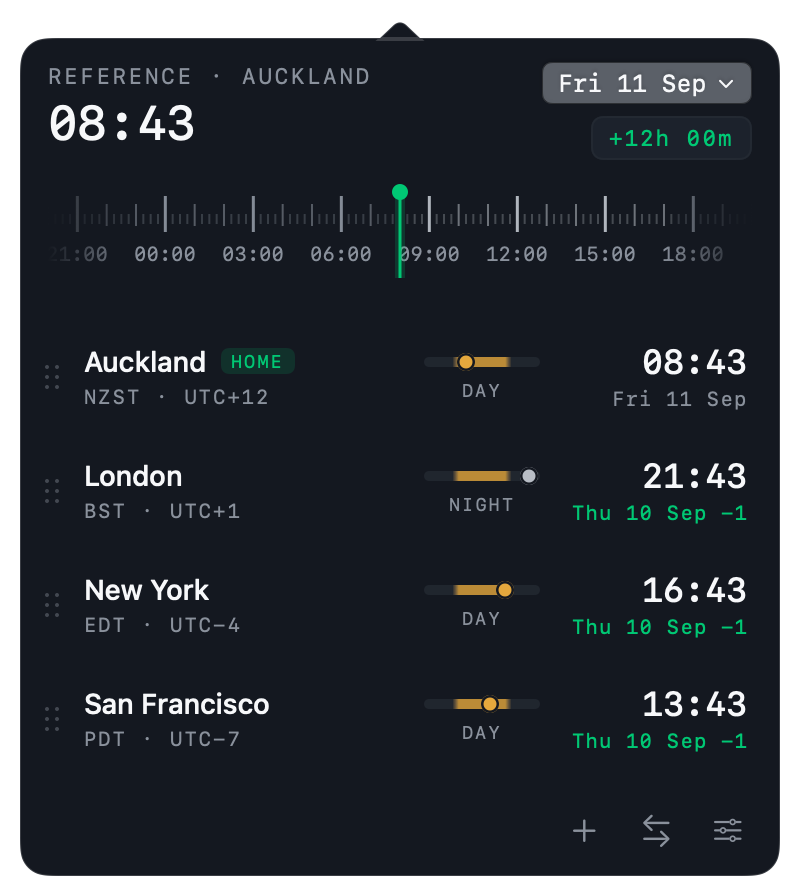
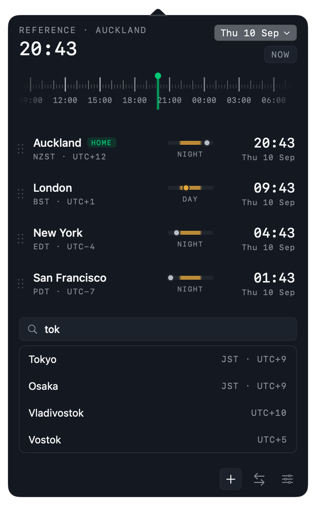
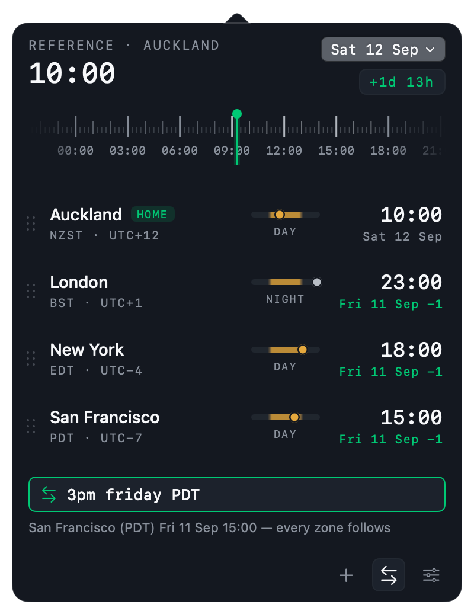
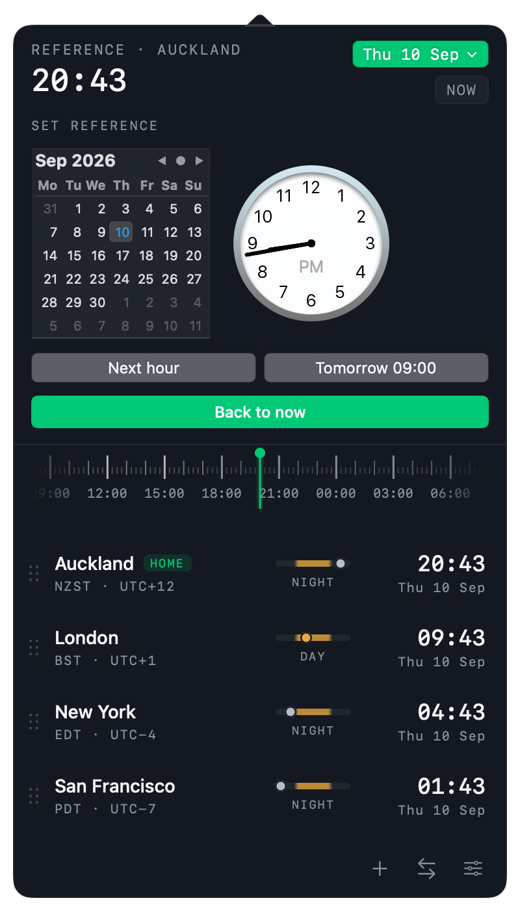
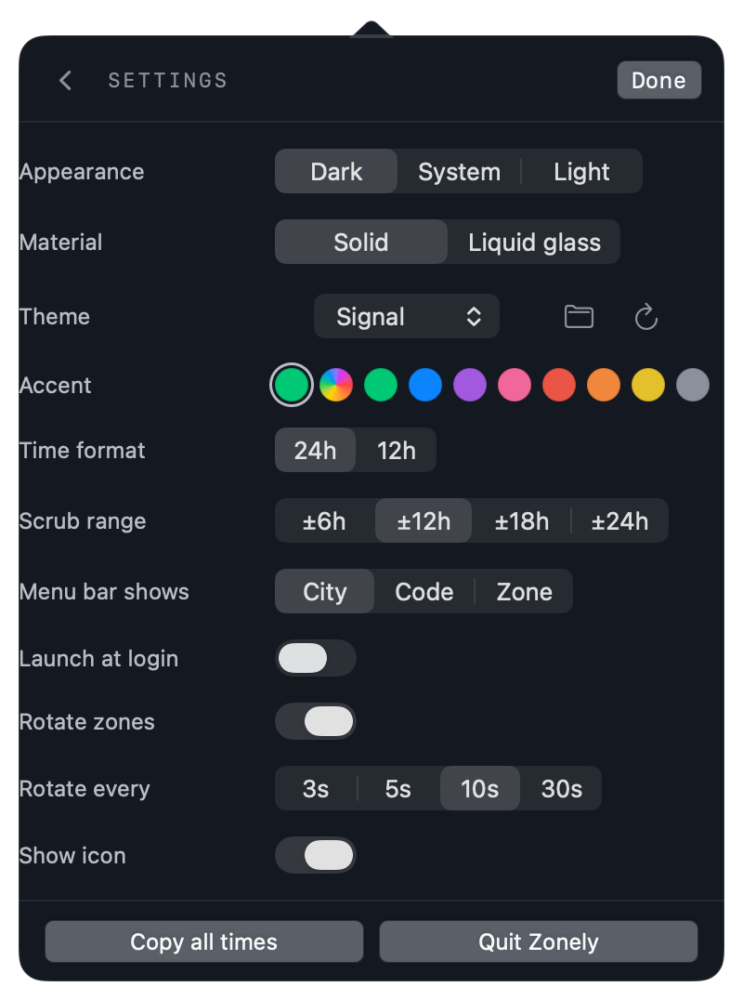
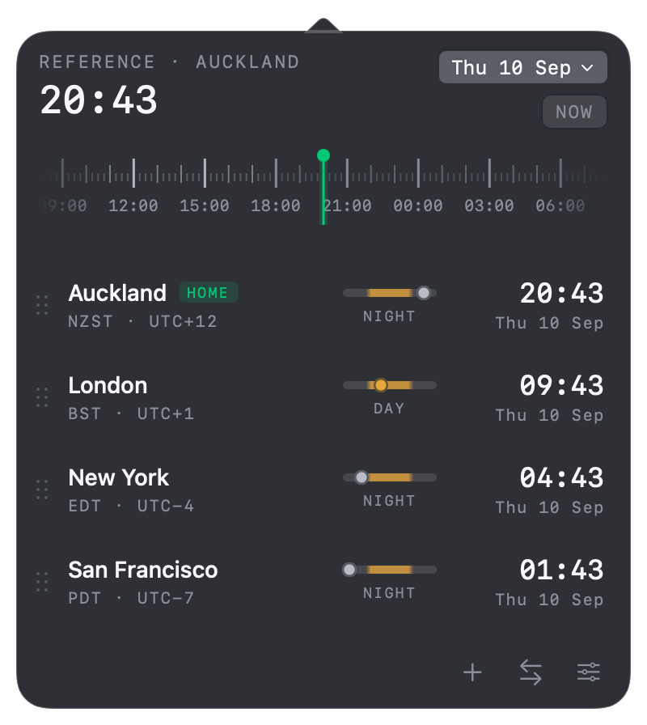

# Zonely


A macOS menu bar clock for several time zones at once, with a scrubber that moves every clock together so I can find a meeting slot without doing arithmetic. It is a native app — SwiftUI inside an `NSStatusItem` and a borderless panel, no Electron, no web view.


[Clocker](https://www.adrakstudio.com/clocker) already does most of this and does it well — if that covers the need, it is the cheaper answer. I wanted the timeline scrubber to be the centre of the panel rather than a slider bolted under it, and I wanted the theme to be a file I can edit, so I built from a design of my own (`design/`).

How it works, in short: the first zone in the list is the reference. The scrubber slides the whole panel forward and backward from the current moment, every row re-reads off that instant, and the day tag turns accented the moment a zone crosses into another calendar day. Nothing is shifted permanently — the `NOW` pill puts it back.

## Contents

1. [Install](#1-install)
2. [The panel](#2-the-panel)
3. [Scrubbing time](#3-scrubbing-time)
4. [Adding zones](#4-adding-zones)
5. [Converting a time](#5-converting-a-time)
6. [Picking an exact date](#6-picking-an-exact-date)
7. [Settings](#7-settings)
8. [Themes](#8-themes)
9. [Building and hacking on it](#9-building-and-hacking-on-it)
10. [Where this differs from the design](#10-where-this-differs-from-the-design)
11. [Not doing, and not sure about](#11-not-doing-and-not-sure-about)

## 1. Install

Download `Zonely.app` from [Releases](../../releases), unzip, and drag it into `/Applications`.

The build is ad-hoc signed and not notarised, so the first launch needs one of:

```sh
xattr -dr com.apple.quarantine /Applications/Zonely.app
```

or right-click the app → **Open** → **Open**. **Launch at login** registers through `SMAppService`, which wants the app in a stable location, so install it before turning that on.

Zonely has no Dock icon and no window. After launching, look for it in the menu bar.

## 2. The panel



Click the menu bar item to open it. Top to bottom:

| Part | What it does |
|---|---|
| **`REFERENCE · AUCKLAND`** | Names the reference zone — the first row in the list. Every other clock is read against it |
| **Big clock** | The reference zone's time at the instant the panel is showing |
| **Date pill** (`Thu 10 Sep ⌄`) | Opens the [date picker](#6-picking-an-exact-date) |
| **`NOW` pill** | Reads `NOW` when unscrubbed, otherwise `+3h 15m` or `+1d 13h`. Click it to snap back to the present |
| **Scrubber** | See [below](#3-scrubbing-time) |
| **Row** | Drag handle, city, `HOME` badge on the reference, zone abbreviation and UTC offset |
| **Day/night bar** | A 24-hour strip with the zone's current position marked, and `DAY` or `NIGHT` under it |
| **Time and date** | The zone's clock, and the calendar day it falls on |

Things you can do to a row:

- **Drag it** to reorder. Moving a row to the top makes it the reference zone — there is a context-menu item for that too.
- **Click the time** to toggle AM/PM for that row alone, without changing the global time format.
- **Double-click the time** to copy `New York 04:41 PM Thu 10 Sep (EDT)` to the clipboard.
- **Hover** to reveal a delete button; right-click for copy and remove.

The menu bar item shows one zone at a time and rotates through the list. Its width is pinned to the widest zone the list can ever show, so rotation never resizes it and the panel never moves out from under your pointer. Right-click the item for **Copy all times** and **Quit**.

## 3. Scrubbing time



Drag the timeline strip — not a handle. The playhead stays in the centre and the strip slides underneath it, in 15-minute steps.

- Ticks are every 15 minutes, hour ticks are taller, and every third hour is labelled.
- Ticks inside **working hours (09:00–18:00)** in the reference zone are drawn brighter, so a workable window is visible without reading the numbers.
- The moment a zone crosses midnight its day tag turns accented and gains `+1` or `−1`, as in the shot above where Auckland has moved to Friday while everyone else is still on Thursday.
- The `NOW` pill becomes a delta and doubles as the reset button.

The range is `±12h` by default and configurable up to `±24h` in Settings.

## 4. Adding zones



Click **+** and type. Search matches on:

| Query | Matches |
|---|---|
| `tok`, `san fran` | City name, by prefix |
| `NYC`, `LHR` | Airport-style code |
| `JST`, `EDT` | Zone abbreviation |
| `Asia/Tokyo` | IANA identifier |
| `utc+5:30`, `gmt-4` | UTC offset |

Around a hundred cities are curated with codes and search terms; every remaining IANA zone is reachable too, so nothing is missing — just less pretty. Press Return to add the first result.

## 5. Converting a time



Click **⇄** and type a time — optionally with a day, optionally with a zone, **in any order**. The named zone is pinned to what you typed and every other clock follows. The line underneath names back what it understood, so you can see it parsed correctly before trusting the result.

| Input | Result |
|---|---|
| `3pm` · `15:30` · `noon` · `midnight` | Sets the reference zone's clock |
| `8pm PDT` | Pins Los Angeles to 20:00; everyone else follows |
| `12:43 NZDT` | Abbreviations work |
| `3pm New York` · `9:45 am london` | So do city names |
| `8pm utc+5:30` · `7am gmt-4` | So do raw offsets |
| `3pm friday` | The next Friday, today included |
| `tomorrow 9am NYC` | `today`, `tomorrow`, `yesterday` |
| `dec 3 9:00 IST` · `3 dec 09:00` | Either word order |
| `2026-12-25 18:00 london` | ISO dates |
| `25/12 18:00` | Slash dates, in your locale's order |

Two rules worth knowing:

**The day is matched before the time.** Otherwise the `3` in `dec 3` gets read as 03:00 before the month is ever considered.

**Abbreviations are not unique**, so they resolve against the zones already on your panel first — `IST` is India, Israel and Ireland; `CST` is Chicago, Shanghai and Taipei. Outside your panel there is a fixed winners table (`IST`→Kolkata, `CST`→Chicago, `BST`→London, `AST`→Riyadh). Typing the city name is the unambiguous way to get the other one.

Every keystroke re-applies from where the scrubber sat when the field opened, not from wherever the last keystroke left it, so a half-typed `8pm P` cannot leave the panel a day out. Clearing the field puts it back.

You can check a phrasing without opening the panel:

```sh
ZONELY_PARSE_TEST=1 /Applications/Zonely.app/Contents/MacOS/Zonely
```

## 6. Picking an exact date



The date pill expands a real macOS graphical date picker under the header, in the reference zone. Below it:

- **Next hour** — jumps to the top of the coming hour.
- **Tomorrow 09:00** — the most common thing I want.
- **Back to now** — resets and closes.

It expands the panel rather than floating over it, which is why it can never be clipped.

## 7. Settings



Reached with the sliders button, and it replaces the panel body rather than floating.

| Setting | Options | Notes |
|---|---|---|
| **Appearance** | Dark · System · Light | System follows macOS |
| **Material** | Solid · Liquid glass | Glass renders the panel over live vibrancy |
| **Theme** | Signal · Graphite · Solar · your own | The folder button opens the themes directory and writes an example; the arrow reloads from disk |
| **Accent** | Theme default, follow macOS, or eight fixed colours | Independent of the theme pack |
| **Time format** | 24h · 12h | Per-row AM/PM is still available by clicking a time |
| **Scrub range** | ±6h · ±12h · ±18h · ±24h | How far the timeline reaches |
| **Menu bar shows** | City · Code · Zone | `Auckland` / `AKL` / `NZST`. City is clearest, Code is narrowest |
| **Launch at login** | on/off | Registers via `SMAppService`; wants the app in `/Applications` |
| **Rotate zones** | on/off | Off shows only the reference zone |
| **Rotate every** | 3s · 5s · 10s · 30s | How long each zone holds the menu bar |
| **Show icon** | on/off | The sun/moon glyph before the time |

**Copy all times** puts the whole list on the clipboard as aligned text, ready to paste into a message:

```
Auckland       20:41  Thu 10 Sep
London         09:41  Thu 10 Sep
New York       04:41  Thu 10 Sep
San Francisco  01:41  Thu 10 Sep
```

## 8. Themes

Appearance, Material and theme pack are three independent axes. The same panel in light, and in liquid glass:

<p>


</p>

A pack is a JSON file in `~/Library/Application Support/Zonely/Themes/`. The folder button in Settings creates the directory, writes `example-midnight.json` to copy from, and opens it. Every key is optional — a pack overrides only what it names, and the rest falls back to the built-in dark or light base depending on `isDark`.

```json
{
  "id": "midnight",
  "name": "Midnight",
  "dark": {
    "isDark": true,
    "surface": "#101423",
    "surfaceAlt": "#182036",
    "accent": "#6f9bff",
    "selection": "#6f9bff24"
  },
  "light": { "isDark": false, "accent": "#3b6fe0" }
}
```

| Key | Used for |
|---|---|
| `surface` | Panel background, and the arrow — they share one fill |
| `surfaceAlt` | Row hover, search field, inset controls |
| `surfacePop` | Search results and other raised surfaces |
| `fg1` `fg2` `fg3` | Primary text, labels, secondary text |
| `accent` | Playhead, `HOME` badge, day-crossed tags, selection |
| `dayMark` | The daylight portion of the day/night bar |
| `track` `border` `panelBorder` | Hairlines and the night portion of the bar |
| `cornerRadius` `vibrant` | Panel shape, and whether it draws over vibrancy |

Colours are `#rrggbb` or `#rrggbbaa`. `lightGlass` and `darkGlass` are optional; without them the glass variant is derived. Hit reload in Settings after editing — no rebuild, no restart.

## 9. Building and hacking on it

```sh
git clone https://github.com/raghulj/zonely.git
cd zonely
./build.sh          # writes build/Zonely.app
open build/Zonely.app
```

`UNIVERSAL=1 ./build.sh` produces an arm64 + x86_64 binary. `CONFIG=debug ./build.sh` skips optimisation. There is no Xcode project — it is a SwiftPM package plus a script that assembles the bundle. Requires macOS 14 or later and a Swift 6 toolchain.

```
Sources/Zonely/
  ZonelyApp.swift        @main, AppDelegate, status item, render modes
  Model/                 Zone, catalog, AppStore (state + persistence), Preferences
  Theme/                 Theme tokens, ThemePack, ThemeRegistry, environment
  Views/                 PanelView, header, scrubber, rows, sections, settings, chrome, styles
  Support/               Formatters, LaunchAtLogin, ConvertQuery, PanelWindowController
Resources/Info.plist     LSUIElement, bundle metadata
Tools/GenerateIcon.swift Draws AppIcon.icns at build time
design/                  The design the panel was built from
docs/                    Everything shown above, all generated by the app itself
```

State lives in one `AppStore` and persists to `UserDefaults` under `zonely.state.v1`.

Every image in this README is rendered by the app, so they can be regenerated after a design change rather than re-captured by hand. None of these are wired to UI, and none of them write to your real settings:

| Variable | Effect |
|---|---|
| `ZONELY_OPEN_AT_LAUNCH=1` | Opens the panel straight away |
| `ZONELY_SNAPSHOT=out.png` | Renders the panel to a file and exits |
| `ZONELY_SNAPSHOT_PAGE=` | `zones` · `settings` · `add` · `convert` · `date` |
| `ZONELY_SNAPSHOT_QUERY=` | Prefills the add or convert field |
| `ZONELY_SNAPSHOT_APPEARANCE=` `_MATERIAL=` `_THEME=` `_SCRUB=` | Composes the shot |
| `ZONELY_GIF=out.gif` | Renders the scrubber sweep as an animated GIF |
| `ZONELY_PARSE_TEST=1` | Runs convert inputs through the parser and prints what each resolves to |
| `ZONELY_DEBUG_LOG=out.log` | Appends clock ticks, panel renders and window geometry |

Snapshots draw through a real `NSWindow` rather than `ImageRenderer`, because `ImageRenderer` cannot draw AppKit-backed controls — segmented pickers and switches came out as blank yellow blocks. One artefact remains: the app cannot become frontmost when launched from a terminal, so controls render in their inactive, untinted style.

## 10. Where this differs from the design

The design file is a web prototype, so some of it describes gestures macOS does not use.

- **Swipe-to-delete became hover-to-delete.** Rows do not swipe on a trackpad the way they do on a phone, so the delete button fades in on hover and there is a context menu item beside it.
- **The date picker and settings expand in place** instead of floating as small popovers. A popover inside the panel fights the parent for key window and can dismiss it; expanding avoids that and gives settings room to grow.
- **The panel is a borderless `NSPanel`, not an `NSPopover`.** `NSPopover` draws its own arrow in the system material and does not expose it, so against a themed surface the triangle showed as a differently-coloured notch above the panel. `PanelChromeShape` draws body and arrow as one path with one fill, which is also what makes a custom theme's surface reach the arrow.
- **Segmented controls and switches are the real AppKit ones**, not drawn pills, so they pick up the system accent and focus ring.

## 11. Not doing, and not sure about

Non-goals: calendar integration, meeting scheduling, a Today widget, syncing between machines.

Open questions:

- The panel window is created on first open rather than at launch. Bringing up a window pulls in the whole CoreAnimation stack — about 115MB of transient allocation — so a menu bar app that is never clicked should not pay for it. Idle is 16MB; opening the panel settles around 26MB.
- The status item width is pinned to the widest zone the list can show. A long city name is expensive — "San Francisco" reserves about 180pt of menu bar. Switching **Menu bar shows** to Zone or Code gets most of it back. *(A per-zone short name would be better than truncating at 12 characters.)*
- Abbreviations come from a hand-written table for about sixty zones, because ICU answers "GMT+12" for Auckland in `en_US`. Everything outside the table falls back to showing the UTC offset alone. *(Fine so far, but it is a table I will have to maintain.)*
- The day/night bar hardcodes daylight as roughly 06:00–18:00 rather than computing real sunrise and sunset from latitude. *(Correct enough at temperate latitudes, visibly wrong in Reykjavik in December.)*
- The graphical date picker is the one control that ignores the theme: `NSDatePicker` paints an opaque light calendar of its own, and SwiftUI does not expose the `drawsBackground` property that would turn it off. Wrapping it in an `NSViewRepresentable` would fix it. *(Visible in the screenshot above, and the only place a light box appears inside a dark panel.)*
- The scrubber snaps to 15 minutes with no way to go finer. Five would be better for some calls, and it should probably be a setting rather than a constant.
- There are no tests. `ZONELY_PARSE_TEST` covers the convert grammar by eye, which is the part most likely to break, but it asserts nothing.
- Rotating the menu bar item is either the best part or the most annoying part and I have not decided which. It can be turned off, and the interval is a setting.

## License

MIT — see [LICENSE](LICENSE).
