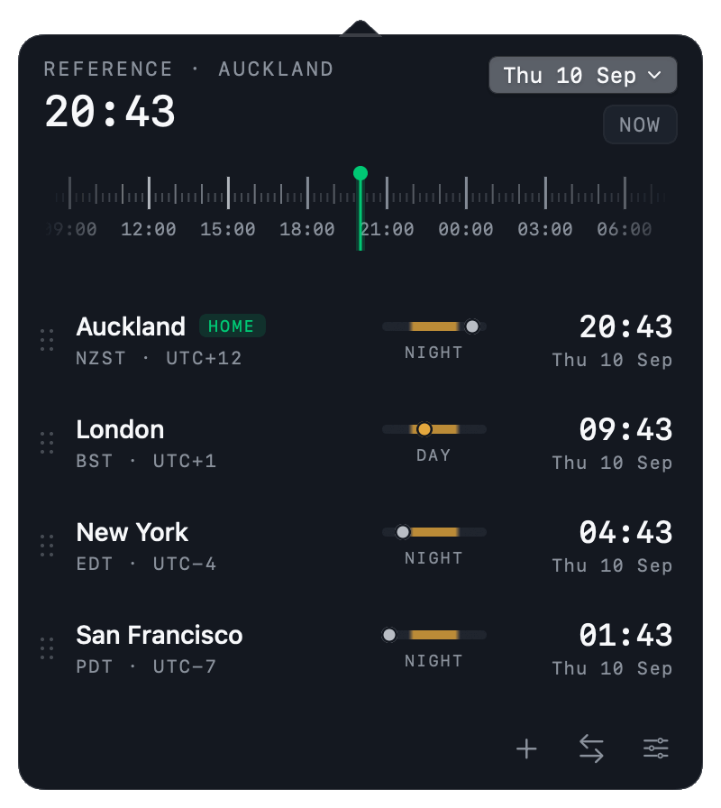
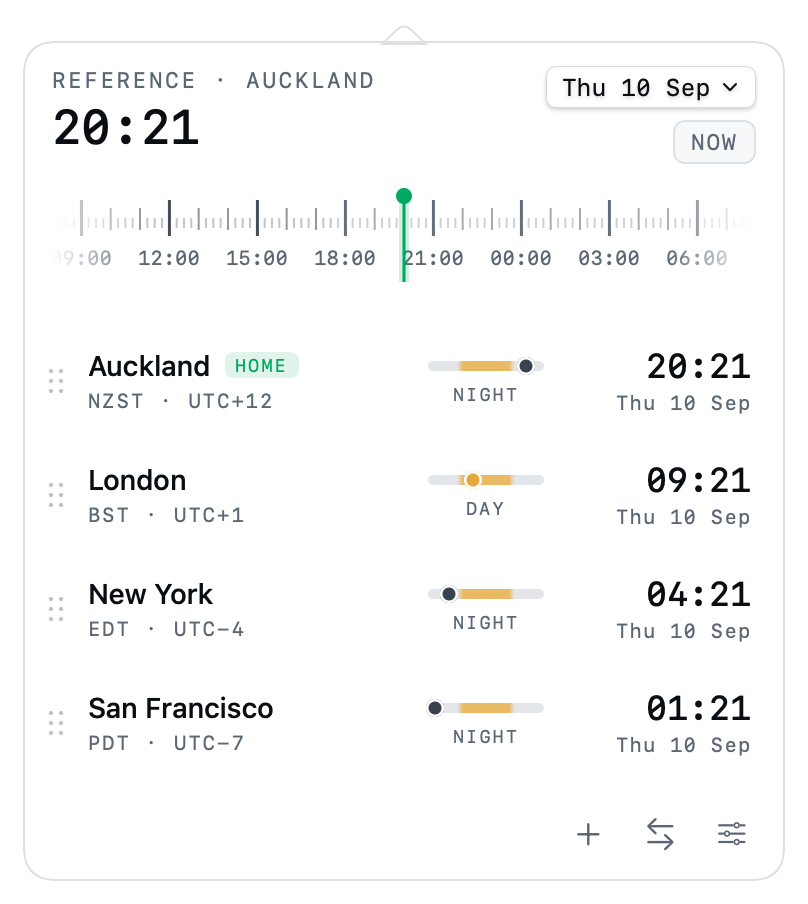

# Zonely


A macOS menu bar clock for several time zones at once, with a scrubber that moves every clock together so I can find a meeting slot without doing arithmetic. It is a native app — SwiftUI inside an `NSStatusItem` and a borderless panel, no Electron, no web view.



[Clocker](https://www.adrakstudio.com/clocker) already does most of this and does it well — if that covers the need, it is the cheaper answer. I wanted the timeline scrubber to be the centre of the panel rather than a slider bolted under it, and I wanted the theme to be a file I can edit, so I built from a design of my own (`design/`).

How it works, in short: the first zone in the list is the reference. The scrubber slides the whole panel forward and backward in 15-minute steps from the current moment, every row re-reads off that instant, and the day tag turns accented the moment a zone crosses into another calendar day. Nothing is shifted permanently — the `NOW` pill puts it back.

## 1. Install

Download `Zonely.app` from [Releases](../../releases), unzip, and drag it into `/Applications`.

The build is ad-hoc signed and not notarised, so the first launch needs one of:

```sh
xattr -dr com.apple.quarantine /Applications/Zonely.app
```

or right-click the app → **Open** → **Open**. **Launch at login** registers through `SMAppService`, which wants the app in a stable location, so install it before turning that on.

Zonely has no Dock icon and no window — after launching, look for it in the menu bar.

### Build it yourself

```sh
git clone https://github.com/raghulj/zonely.git
cd zonely
./build.sh          # writes build/Zonely.app
open build/Zonely.app
```

`UNIVERSAL=1 ./build.sh` produces an arm64 + x86_64 binary. `CONFIG=debug ./build.sh` skips optimisation. There is no Xcode project — it is a SwiftPM package plus a script that assembles the bundle. Requires macOS 14 or later and a Swift 6 toolchain.

## 2. What is in the panel

| Element | Behaviour |
|---|---|
| Menu bar item | Sun or moon, the zone name, and the time, at a **fixed width** measured from the widest zone in the list, so rotation never shifts it. Right-click for copy-all and quit |
| Reference header | The home zone's clock, big. The date pill opens a graphical date picker; the pill under it reads `NOW` or `+3h 15m` and resets on click |
| Scrubber | Drag the strip, not a handle. Ticks every 15 minutes, hours taller, working hours (09–18) brighter, labels every 3 hours |
| Row | Drag handle, city, `HOME` badge, abbreviation and UTC offset, a 24-hour day/night bar with the zone's position marked, the time, the date |
| Time cell | Click toggles AM/PM for that row, double-click copies the line |
| Convert (⇄) | A time, optionally a day, optionally a zone, in any order |
| Add (+) | Search by city, airport code, zone id or `utc+5:30` |

Rows reorder by dragging. Moving a row to the top makes it the reference zone (there is also a context menu item for it). Hovering a row reveals a delete button.

### Convert

The convert field takes a time, and optionally a day and a zone, in any order:

| Input | Result |
|---|---|
| `3pm` · `15:30` · `noon` | Sets the reference zone's clock |
| `8pm PDT` | Pins Los Angeles to 20:00, every other zone follows |
| `12:43 NZDT` · `3pm New York` | Abbreviation or city name both work |
| `3pm friday` · `tomorrow 9am NYC` | Next occurrence of that day |
| `dec 3 9:00 IST` · `3 dec 09:00` | Either word order |
| `2026-12-25 18:00 london` | ISO dates are unambiguous |
| `8pm utc+5:30` | Raw offsets too |

The day is matched and removed before the time, because the `3` in `dec 3` would otherwise be read as 03:00 before the month was ever considered. Slash dates follow the machine's locale for `12/25` vs `25/12`.

Abbreviations are matched against the zones already on the panel first, because they are not unique — `IST` is India, Israel and Ireland; `CST` is Chicago, Shanghai and Taipei. Outside the panel there is a fixed winners table (`IST`→Kolkata, `CST`→Chicago, `BST`→London). Typing the city name is the unambiguous way.

## 3. Themes



Appearance (Dark / System / Light) and Material (Solid / Liquid glass) are independent, and both apply on top of a **theme pack**. Three ship in the binary: Signal, Graphite, Solar.

A pack is a JSON file in `~/Library/Application Support/Zonely/Themes/`. The folder button in Settings creates the directory, writes `example-midnight.json` to copy from, and opens it. Every key is optional — a pack overrides only what it names, and the rest falls back to the built-in dark or light base depending on `isDark`.

```json
{
  "id": "midnight",
  "name": "Midnight",
  "dark": {
    "isDark": true,
    "surface": "#101423",
    "surfaceAlt": "#182036",
    "accent": "#6f9bff",
    "selection": "#6f9bff24"
  },
  "light": { "isDark": false, "accent": "#3b6fe0" }
}
```

Colours are `#rrggbb` or `#rrggbbaa`. `lightGlass` and `darkGlass` are optional; without them the glass variant is derived from the solid one. Hit the reload button in Settings after editing — no rebuild, no restart.

The accent is a separate axis again: theme default, follow the macOS accent colour, or one of eight fixed swatches.

## 4. Layout

```
Sources/Zonely/
  ZonelyApp.swift        @main, AppDelegate, status item, dev render modes
  Model/                 Zone, catalog, AppStore (state + persistence), Preferences
  Theme/                 Theme tokens, ThemePack, ThemeRegistry, environment
  Views/                 PanelView, header, scrubber, rows, sections, settings, chrome, styles
  Support/               Formatters, LaunchAtLogin, ConvertQuery, PanelWindowController
Resources/Info.plist     LSUIElement, bundle metadata
Tools/GenerateIcon.swift Draws AppIcon.icns at build time
design/                  The design the panel was built from
```

State lives in one `AppStore` and persists to `UserDefaults` under `zonely.state.v1`.

Four environment variables help while working on it, and none of them are wired to UI:

| Variable | Effect |
|---|---|
| `ZONELY_OPEN_AT_LAUNCH=1` | Opens the panel straight away |
| `ZONELY_SNAPSHOT=out.png` | Renders the panel to a file and exits. Add `ZONELY_SNAPSHOT_PAGE=settings`, `ZONELY_SNAPSHOT_APPEARANCE=light`, `ZONELY_SNAPSHOT_MATERIAL=glass` |
| `ZONELY_GIF=out.gif` | Renders the scrubber sweep as an animated GIF — this is how `docs/demo.gif` is made, no screen recording involved |
| `ZONELY_PARSE_TEST=1` | Runs convert-field inputs through the parser and prints what each resolves to |
| `ZONELY_DEBUG_LOG=out.log` | Appends clock ticks, panel renders and window geometry |

`ImageRenderer` does not draw AppKit-backed controls or `ScrollView` content, so pickers and toggles come out as yellow blocks in a snapshot of the settings page. That is the renderer, not the app.

## 5. Where this differs from the design

The design file is a web prototype, so some of it describes gestures macOS does not use.

- **Swipe-to-delete became hover-to-delete.** Rows do not swipe on a trackpad the way they do on a phone, so the delete button fades in on hover and there is a context menu item beside it.
- **The date picker and settings expand in place** instead of floating as small popovers. A popover inside the panel fights the parent for key window and can dismiss it; expanding the panel avoids that and gives settings room to grow.
- **The panel is a borderless `NSPanel`, not an `NSPopover`.** `NSPopover` draws its own arrow in the system material and does not expose it, so against a themed surface the triangle showed as a differently-coloured notch above the panel. `PanelChromeShape` draws body and arrow as one path with one fill, which is also what makes a custom theme's surface reach the arrow.
- **Segmented controls and switches are the real AppKit ones**, not drawn pills, so they pick up the system accent and focus ring.

## 6. Not doing, and not sure about

Non-goals: calendar integration, meeting scheduling, a Today widget, syncing between machines.

Open questions:

- The panel window is created on first open rather than at launch. Bringing up a window pulls in the whole CoreAnimation stack — about 115MB of transient allocation — so a menu bar app that is never clicked should not pay for it. Idle is 16MB, and opening the panel settles around 26MB.
- The status item width is pinned to the widest zone the list can show. A long city name is expensive — "San Francisco" reserves about 180pt of menu bar. Switching **Menu bar shows** to Zone or Code gets most of it back. *(A per-zone short name would be better than truncating at 12 characters.)*
- Abbreviations come from a hand-written table for about sixty zones, because ICU answers "GMT+12" for Auckland in `en_US`. Everything outside the table falls back to showing the UTC offset alone. *(Fine so far, but it is a table I will have to maintain.)*
- The day/night bar hardcodes daylight as roughly 06:00–18:00 rather than computing real sunrise and sunset from latitude. *(Correct enough at temperate latitudes, visibly wrong in Reykjavik in December.)*
- The scrubber snaps to 15 minutes with no way to go finer. Five would be better for some calls, and it should probably be a setting rather than a constant.
- There are no tests. `ZONELY_PARSE_TEST` covers the convert grammar by eye, which is the part most likely to break, but it asserts nothing.
- Rotating the menu bar item is either the best part or the most annoying part and I have not decided which. It can be turned off, and the interval is a setting.

## License

MIT — see [LICENSE](LICENSE).
